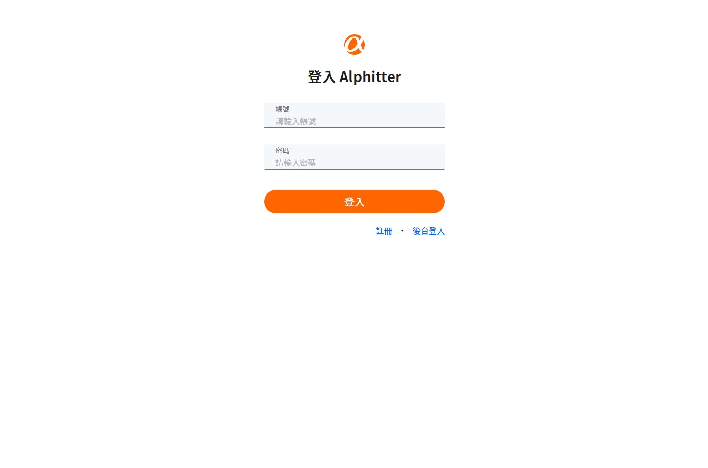
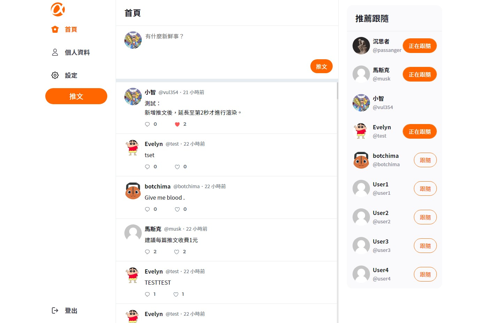
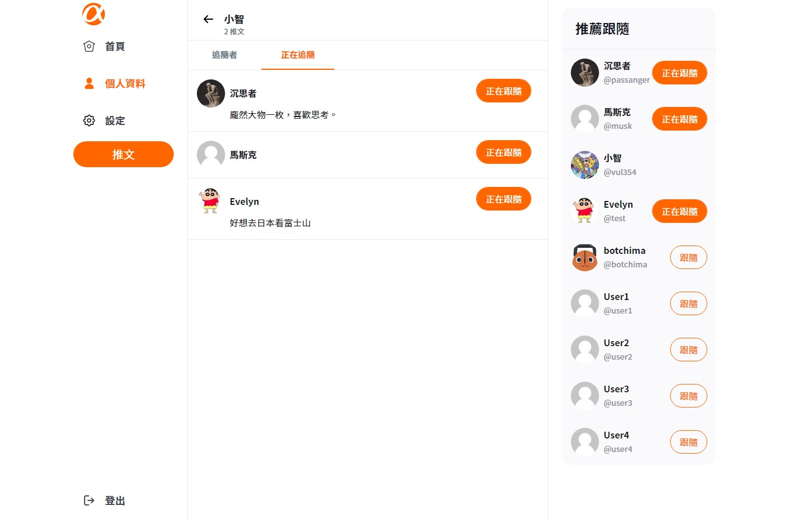
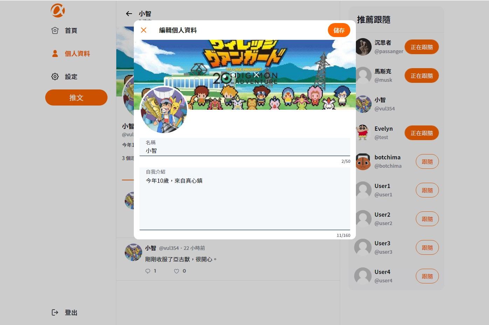
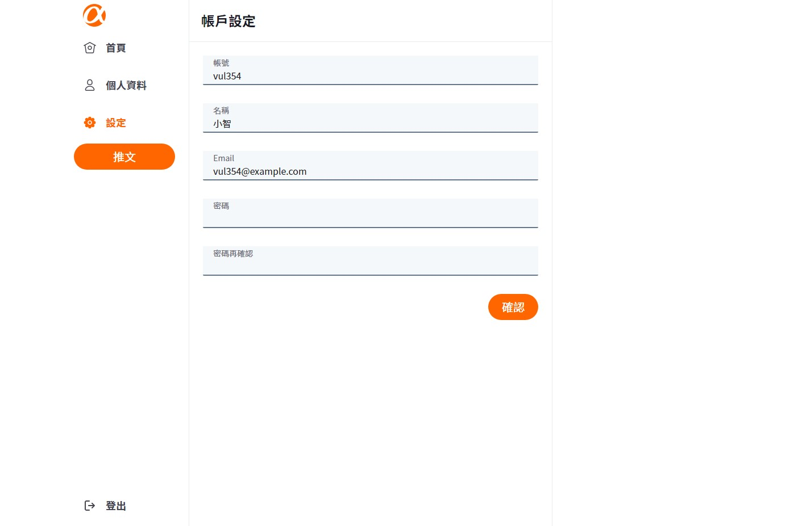
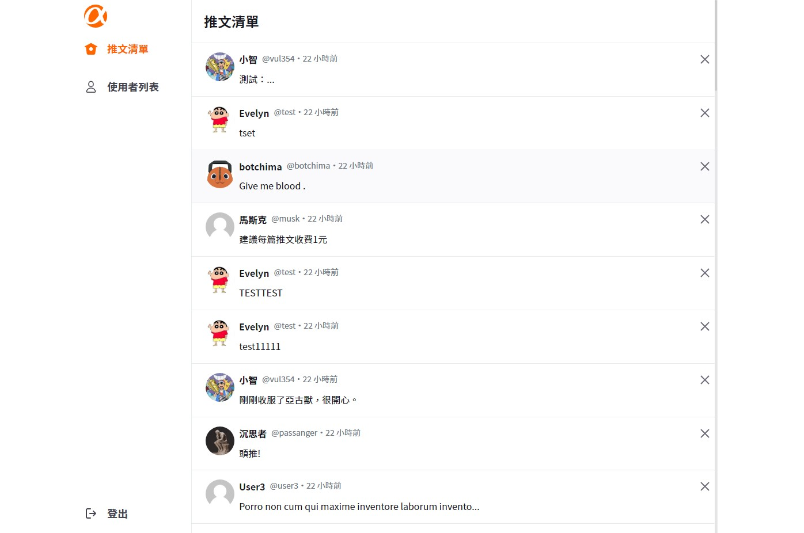

# simple twitter

<a href="https://yuwen-ctw.github.io/simple_twitter/login" target="_blank">DEMO</a>

|                                                                                                  |                                                                                                        |
| :----------------------------------------------------------------------------------------------: | :----------------------------------------------------------------------------------------------------: |
|         登入        |                 首頁                 |
|        推文頁       |         個人頁        |
|  追隨清單 |         編輯個人自介        |
|   編輯帳戶資訊  |  管理者推文頁面 |

# 功能

- 使用者可以註冊新身分，並以此身分登入並使用網站。
- 使用者能在首頁瀏覽所有推文、新增貼文、新增回覆、或對推文按愛心並加入收藏。
- 使用者能在首頁的推薦跟隨名單，看見追隨者數量排列前 10 名的使用者，並進行追隨或取消追隨。
- 點擊使用者頭像，能造訪該使用者個人頁面，檢視該使用者之個人簡介與活動情形，並可進行追隨或取消追隨。
- 使用者能於導覽列造訪自己的個人頁面與設定頁面，以編輯自己的名稱、介紹、大頭照和個人頁橫幅背景或帳號密碼等註冊資料。
- 管理者可透過後台登入頁面登入，並使用管理者相關功能。
- 管理者可以瀏覽全站的推文清單，並快覽每則推文第 1 行或前 50 字。
- 管理者可以瀏覽站內所有的使用者清單，並依使用者推文數由多至少進行排序。

# 使用方法

1.打開終端機，Clone 專案至本機

```
git clone https://github.com/Yuwen-ctw/simple_twitter.git
```

2.進入專案資料夾

```
cd simple_twitter
```

3.安裝 npm 套件

```
npm install
```

4.啟動專案

```
npm start
```

5.成功後會自動開啟網站

<br/>

# 資料夾結構

src\
　| _ apis \
　| _ assests - 管理 image, svg, style\
　| _ components \
　| _ contexts \
　| _ pages \
　| _ routes \
　| _ utilities

<br/>

## 開發工具

- creat-react-app - 框架
- react-router-dom - 路由
- scss - CSS 預處理器
- axios - 處理 HTTP 請求
- json-server - 模擬 API
  <br/>
  <br/>
  <br/>

## 開發人員

- 前端 - <a href="https://github.com/Yuwen-ctw" target="_blank">Yuwen</a>、
  <a href="https://github.com/whps40333" target="_blank">whps40333</a>
- 後端 - <a href="https://github.com/miaout11" target="_blank">Evelyn</a>、<a href="https://github.com/Coli-co" target="_blank">Timothy</a>
