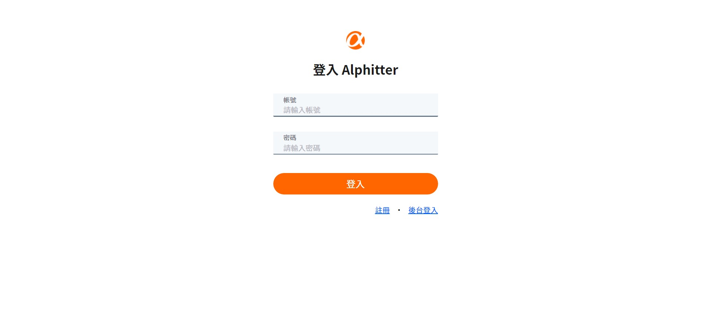

# simple twitter



# 功能

- 使用者可以透過註冊獲得一組帳密，並以此登入網站。
- 登入網站後，使用者能在首頁瀏覽所有推文，並進行貼文與回覆。
- 點及使用者頭像，使用者能瀏覽自己的推文和個人資料。
- 使用者可以追蹤或取消追蹤其他使用者，無法追蹤自己。
- 使用者能對別人的推文按 Like/Unlike
- 使用者能編輯自己的名稱、介紹、大頭照和個人頁橫幅背景
- 使用者能在首頁的側邊欄，看見跟隨者 (followers) 數量排列前 10 的推薦跟隨名單
- 管理者可從專門的後台登入頁面進入網站後台
- 管理者可以瀏覽全站的 Tweet 清單
- 管理者可以瀏覽站內所有的使用者清單，資料包含使用者社群活躍數據、使用者清單預設。清單依據推文數排序，由多至少。

# 使用方法

1.打開終端機，Clone專案至本機

```
git clone https://github.com/Yuwen-ctw/simple_twitter.git
```
2.進入專案資料夾

```
cd simple_twitter
```
3.安裝npm套件

```
npm install
```
4.啟動專案

```
npm start
```
5.成功後會自動開啟網站，或點擊 http://localhost:3000 進入頁面。